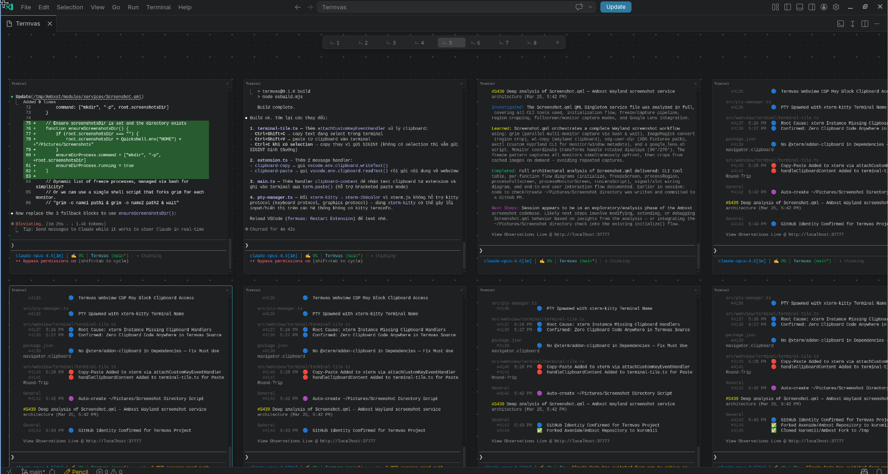

# Termvas

An infinite canvas with terminal tiles for VSCode.

Open multiple terminals, arrange them freely on a zoomable canvas, and work across projects in one view.



## Features

- Infinite pan & zoom canvas
- Multiple terminal tiles — drag, resize, duplicate
- Persistent layout across sessions
- WebGL-accelerated rendering
- Copy/paste support (Ctrl+Shift+C / Ctrl+Shift+V)
- VSCode theme integration

## Usage

1. Open Command Palette (`Ctrl+Shift+P`)
2. Run **Termvas: Open Canvas**
3. Terminals are created automatically — drag and resize to arrange

### Shortcuts

| Key | Action |
|-----|--------|
| Ctrl+Wheel | Zoom in/out |
| Middle mouse / Space+drag | Pan canvas |
| Ctrl+Shift+C | Copy selection |
| Ctrl+Shift+V | Paste |
| Ctrl+C (with selection) | Copy |
| Ctrl+D | Duplicate selected tile |
| Delete / Backspace | Remove selected tile |

## Install from source

```bash
git clone https://github.com/user/termvas.git
cd termvas
npm install
npm run build
```

Then symlink into VSCode extensions:

```bash
npm run install-ext
```

Reload VSCode and run **Termvas: Open Canvas**.

## License

MIT
